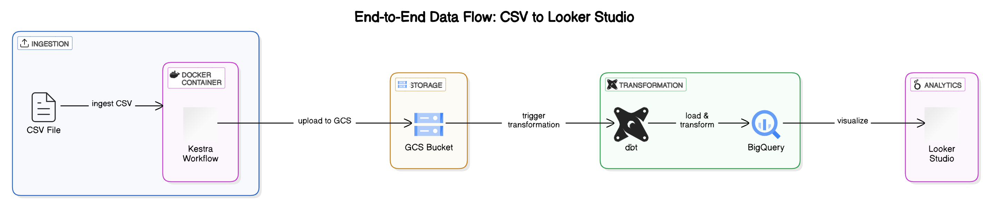

# Data Engineering Zoomcamp Final Project

## Project Goals

This project aims to analyze trends in insurance premium amounts from 2022 to 2025 across various demographic and categorical groups. The primary focus is on identifying significant patterns or anomalies in the maximum insurance premium amounts during this period.  
### Why Analyze Maximum Premium Amounts?

Analyzing maximum premium amounts provides critical insights into the upper bounds of insurance costs, which can help identify outliers, anomalies, or trends that may indicate systemic issues or opportunities for optimization. By focusing on the maximum values, we can:

- Detect potential cases of overpricing or fraud.
- Understand the impact of demographic and categorical factors on premium costs.
- Inform policy decisions to ensure affordability and fairness in insurance pricing.
- Highlight areas where intervention or regulation may be necessary to protect consumers.

This analysis is particularly valuable for stakeholders such as policymakers, insurers, and consumer advocacy groups aiming to improve transparency and equity in the insurance market.

## ETL Architecture


Data Source → Kestra (Docker) → GCP Bucket → BigQuery → Looker Studio 
The ETL architecture for this project is designed to extract data from various sources, transform it into a structured format, and load it into a data warehouse for analysis. Below is the architecture diagram:




1. **Data Source**  
    - The pipeline utilizes Qualified Health Plan (QHP) data and publicly available health files sourced from marketplace health insurance websites. These datasets provide comprehensive information on insurance premiums and related attributes.

2. **Data Orchestration & Ingestion**  
    - **Tool:** Kestra  
      Kestra, running in a Docker container, orchestrates the entire data ingestion process. It automates the extraction of raw data, ensuring seamless and reliable loading into the cloud storage.

3. **Cloud Storage**  
    - **Tool:** Google Cloud Storage (GCS)  
      The ingested CSV files are stored in a GCP Bucket, serving as the landing zone for raw data. This ensures scalability, durability, and easy accessibility for downstream processing.

4. **Data Transformation**  
    - **Tool:** DBT (Data Build Tool)  
      DBT is used to transform the raw data into a structured format. It creates a star schema by generating fact and dimension tables in BigQuery, enabling efficient querying and analysis.

5. **Data Warehouse**  
    - **Tool:** BigQuery  
      BigQuery acts as the central data warehouse, storing the transformed data. Its powerful querying capabilities allow for fast and scalable analysis of large datasets.

6. **Data Visualization**  
    - **Tool:** Looker Studio  
      Looker Studio is used to create interactive dashboards and visualizations. These provide stakeholders with actionable insights into trends, anomalies, and patterns in insurance premium data.

**Link to the dashboard:**  
[Insurance Premium Dashboard](https://lookerstudio.google.com/reporting/5ef34b9e-ea05-4925-b5e8-c13f94593982)

---

## How to Run the Project

### Prerequisites
- Ensure you have **Terraform**, **Docker Compose**, and **Python** installed on your system.
- Set up a **Google Cloud Platform (GCP)** project with the necessary permissions and resources.

---

### 1. Set Up Terraform

1. Navigate to the `terraform/` directory in the project.
2. Initialize Terraform by running:
    ```sh
    terraform init
    ```
3. Generate an execution plan to preview the changes Terraform will make:
    ```sh
    terraform plan
    ```
4. Apply the changes to create the required infrastructure:
    ```sh
    terraform apply
    ```
    Confirm the prompt to proceed.

---

### 2. Configure and Run Kestra Workflows

1. Update the `04_gcp_kv.yaml` file with your GCP details:
    - **GCP_CREDS**: Path to your service account JSON file.
    - **GCP_PROJECT_ID**: Your GCP project ID.
    - **GCP_LOCATION**: The region for your resources.
    - **GCP_BUCKET_NAME**: Name of your GCS bucket.
    - **GCP_DATASET**: Name of your BigQuery dataset.

    > **Note:** Keep the `GCP_CREDS` file secure and do not commit it to version control.

2. Start Kestra using Docker Compose:
    ```sh
    docker compose up
    ```
3. Import the workflow files into Kestra:
    ```sh
    curl -X POST http://localhost:8080/api/v1/flows/import -F fileUpload=@flows/04_gcp_kv.yaml
    curl -X POST http://localhost:8080/api/v1/flows/import -F fileUpload=@flows/05_gcp_flow.yaml
    curl -X POST http://localhost:8080/api/v1/flows/import -F fileUpload=@flows/06_gcp_puf.yaml
    curl -X POST http://localhost:8080/api/v1/flows/import -F fileUpload=@flows/07_gcp_puf.yaml
    ```

---

### 3. Set Up and Run the DBT Project

1. Navigate to the `insurance-marketplace-dbt` directory.
2. Create and activate a virtual environment:
    ```sh
    python -m venv venv
    source venv/bin/activate  # On Windows, use `venv\Scripts\activate`
    ```
3. Install the required Python packages:
    ```sh
    pip install -r requirements.txt
    ```
4. Verify the setup:
    ```sh
    python main.py --help
    ```
5. Update the `profiles.yml` file with your GCP project details and run the DBT commands to build the models.

6. Run the DBT commands to build and test the models:
    ```sh
    dbt deps
    dbt seed
    dbt run
    ```
7. Generate and view the documentation:
    ```sh
    dbt docs generate
    dbt docs serve
    ```
---
### Accessing the DBT Documentation

To explore the current schema and detailed DBT documentation for this repository, visit the GitHub Pages site:  
[DBT Documentation](https://fsjoyti.github.io/dataeng-zoomcamp-final-project/)

### 4. Access the Dashboard

Once the data pipeline is complete, view the analysis on the [Insurance Premium Dashboard](https://lookerstudio.google.com/reporting/5ef34b9e-ea05-4925-b5e8-c13f94593982).

Use optional metrics to analyze maximum insurance premium amounts across various categories in both of these visualizations. Leverage the drill-down feature in the bar chart to explore maximum premium amounts by `plan_year`, `state`, or `market_type` for deeper insights. 

---

### Notes

- Update the `variables.tf` file with your specific project details (e.g., `project`, `region`, `gcs_bucket_name`) before running Terraform.
- Ensure all sensitive information, such as service account credentials, is securely stored and not committed to version control.

